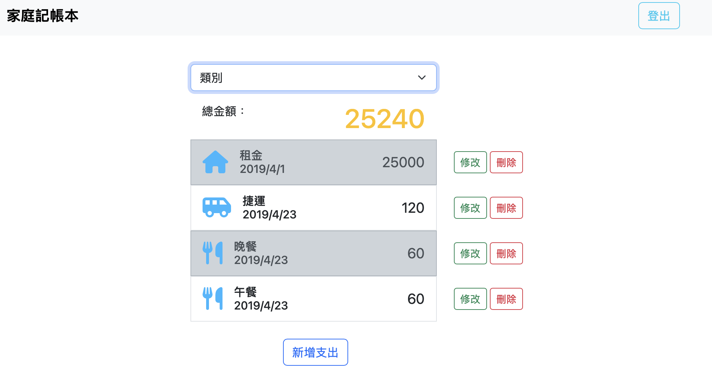

# 家庭記帳本
 
 ## 功能
 + 使用者能夠註冊帳號，建立自己的記帳本。
 + 使用者自行新增刪除編輯消費紀錄。
 + 使用者能夠查看指定項目的消費紀錄。

 ## 環境建置與相關套件
 1. Node.js
 2. npm(Node Package Manager)

 ## 專案安裝與執行步驟
 1. 請先確認「環境建置與需求」第1點及第2點提及的程式皆已安裝。
 2. 將此專案clone到本地。
 3. 開啟終端機，在專案資料夾執行：
 ```
 cd file path  #專案資料夾路徑
 npm init -y 
 ```
 4. 接著在終端機安裝套件：
 ```
 # "express": "^4.18.2",
 npm install express@6.14.11
 ```
 5. 在目標資料夾新增.env檔，並自行設定相關私密資訊到內文中。
 ```
 # .env的內文
 MONGODB_URI=<您的MongoDB URI>
 FACEBOOK_ID=<您的Facebook專案ID>
 FACEBOOK_SECRET=<您的Facebook專案密碼>
 FACEBOOK_CALLBACK=<您的Facebook專案CALLBACK網址>
 SESSION_SECRET=<您的SESSION設定>
 PORT=<您的PORT>
 ```
 6. 將測試資料json資料載入到資料庫。
 ```
 npm run seed
 ```
 7. 在終端機啟動伺服器。
 ```
 npm run start (node app.js)
 npm run dev (nodemon app.js)
 ```
 8. 在瀏覽器輸入http://localhost:3000，即可連線。

 9. 可先用種子資料帳密登入察看使用功能
    - email輸入 user1@gmail.com
    - password輸入 1234

